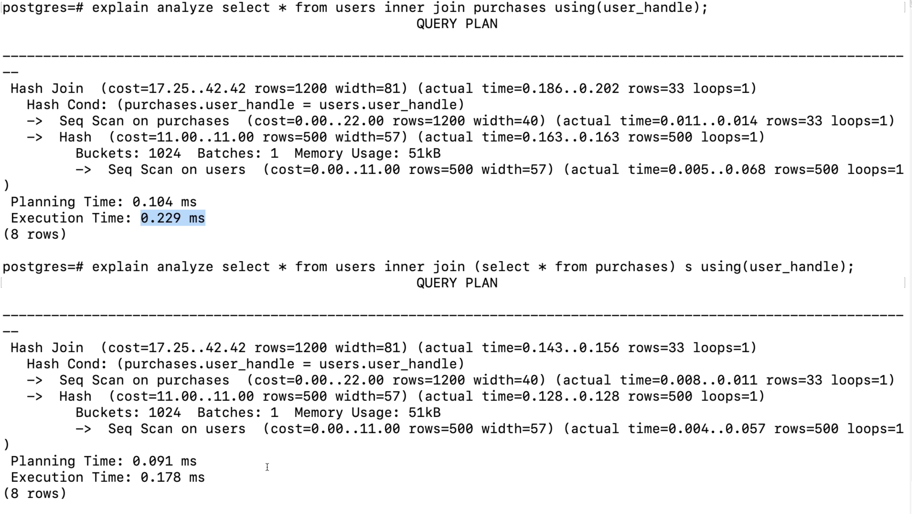

# Profiling Queries with Explain Analyze

[Video link](https://www.egghead.io/lessons/postgresql-profiling-queries-with-explain-analyze)

Instructor: [0:00] You can't have a course on advanced SQL without talking about query performance and optimizations. Let's jump right in and write `explain select * from users;`. 

```postgres
postgres=# explain select * from users;
                    QUERY PLAN
------------------------------------------------------
Seq Scan on users (cost=0.00..11.00 rows=500 width=57)
```

What we're looking at here is the execution plan that the Postgres planner generates for our select statement.

[0:17] This plan is brought to us by the use of this explain keyword here. This execution plan shows how the table reference by statement will be scanned. In our case we're going to use the sequential scan for our select statement.

[0:32] The biggest takeaway from our generated plan is the cost here. There are actually two different values. They're separated by these double dots. This side, the first, is the startup cost, `0.00`, and the second is the total cost, `11.00`.

[0:46] The startup time is the time it takes before the first row can be returned and this total time is what it will take to return all of the rows from our query. We have a zero startup cost and 11 for total cost. The measurement for this is units of disk page fetches. This other data is the number of rows within our user's table, `500`, and this width is referencing the size of our plan, `57`.

[1:12] We can see the same output of our explain but in a different format by stating `format json`. 

```postgres
postgres=# explain (format json) select * from users;
          QUERY PLAN
--------------------------------
[                              +
  {                            + 
    "Plan": {                  + 
      "Node Type": "Seq Scan", +
      "Parallel Aware": false, +
      "Relation Name": "users",+
      "Alias": "users",        +
      "Startup Cost": 0.00,    +
      "Total Cost": 11.00,     +
      "Plan Rows": 500,        +
      "Plan Width": 57         +
    }                          +
  }                            +
]                              + 
```

Other formats include xml, text, and yaml. We can give as much info as possible by stating `verbose` with our explain. Some additional info we get here is which schema this table exists on and the table columns.

```postgres
postgres=# explain verbose select * from users;
                        QUERY PLAN
-------------------------------------------------------------
Seq Scan on public.users (cost=0.00..11.00 rows=500 width=57)
  Output: user_handle, first_name, last_name, email, status
(2 rows)
```

[1:36] I haven't even mentioned the most important thing about explain. When using it, we don't actually run our query. For example, if we were to write `update users set email = null`, we're not actually going to update the user's table.

[1:50] The values that you see from the planner is its best guess on the cost. If we actually wanted to get an accurate cost, we have to run the query by adding `analyze with explain` like so.

```postgres
postgres=# explain analyze update users set email = null;
                                            QUERY PLAN
---------------------------------------------------------------------------------------------------------
  Update on users (cost=0.00..11.00 rows=500 width=57) (actual time=5.785..5.785 rows=0 loops=1)
    -> Seq Scan on users (cost=0.00..11.00 rows=500 width=57) (actual time = 0.015..0.232 rows=500 loops=1)
  Planning Time: 0.047 ms
  Execution Time: 5.808 ms
(4 rows)
```

[2:04] Now we can see our explain plan compared and contrasted to the actual implementation of that plan. The analyze option gives us rolled-up times for the planning and the execution of our query. Again, when adding the analyze option, it will actually run your query, so be careful when using it in production on commands like update and delete.

[2:26] With all this info in mind, let's go back to our original `explain` query. With this select, we are performing a sequential scan, `explain select * from users;`. This means that the select statement will loop over every single row one after another until the end.

```postgres
postgres=# explain select * from users;
                    QUERY PLAN
------------------------------------------------------
Seq Scan on users (cost=0.00..11.00 rows=500 width=57)
```

[2:39] There's another scan, which is typically faster, which is called the index scan. We can see that because our users table has a primary key, this automatically creates an index on user handle, and then it'll use an index scan using for that user.

```postgres
postgres=# explain select * from users where user_handle = 'a0eebc99-9c0b-4ef8-bb6d-6bb9bd380a11';
                                QUERY PLAN
-----------------------------------------------------------------------------
  Index Scan using user_pkey on users (cost=0.27..8.29 rows=1 width=65)
    Index Cond: (user_handle = 'a0eebc99-9c0b-4ef8-bb6d-6bb9bd380a11'::uuid)
(2 rows)
```

[2:54] I said that index scan typically is faster as we see here in our total time to return the row. However, it has a startup cost and can actually be slower than a sequential scan in some cases. As we run our queries through the planner, we're going to see that for each aggregation, for each `where` clause that we use, for every join that we end up using, there's going to be a cost.

```postgres
postgres=# explain select sum(quantity) from purchases where date < now();
                        QUERY PLAN
----------------------------------------------------------------
  Aggregate (cost=29.00..29.01 rows=1 width=8)
    -> Seq Scan on purchases (cost=0.00..28.00 rows=400 width=4)
      Filter: (date< now())
(3 rows)
```

[3:18] Our planner will break down and guess as much as it can when using just explain, and as we can see, even when joining tables, we're going to be told which algorithms will be used.

[3:30] One of the biggest debates when SQL query profiling is when to use which option. Should you use a group by? Should you use a distinct? Would a sub-query work better here or possibly a timetable?

[3:41] While some principles like adding indexes are usually true, there is no silver bullet. Each table, number of rows of data, constraints, foreign keys, etc. are different, and all options need to be run through a profiler to find the best option.

[3:57] Now, both of these queries return the same result. One joins on two tables, and the second one joins on a sub-query that wastefully pulls out all the data from a table. However, looking at our times, the sub-query route is microscopically faster.



[4:13] I could rerun these multiple times and they would probably flip flop as far as who is quicker. The point is, there is no silver bullet. Make sure you try all of your options when you're trying to profile your queries.

[4:24] To close, sometimes it can be difficult to read through the planner results, especially with large queries. My go-to tool for getting a pretty visual is this website: [explain.depesz](https://explain.depesz.com/). I'll put the link in the notes of this video. Once we copy and paste our query plan into this section here, it's going to break down the plan into an easy-to-read breakdown, adding colors to indicate which parts were slow and which were fast.
