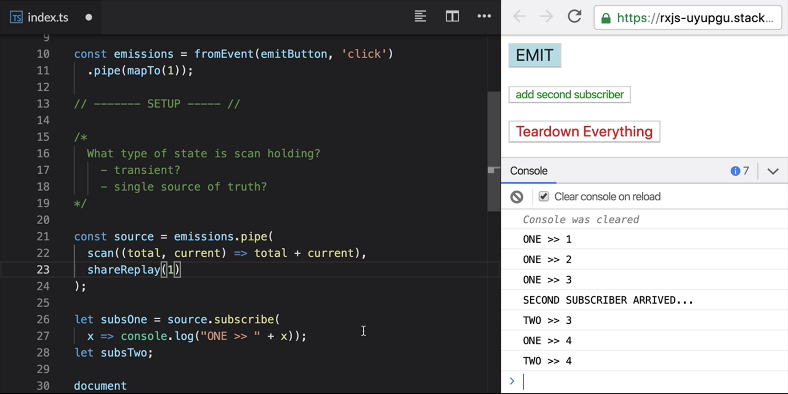

# Maintain shared observable state using the scan and shareReplay operators

[Video link](https://www.egghead.io/lessons/egghead-maintain-shared-observable-state-using-the-scan-and-sharereplay-operators)

Instructor: [0:00] We'll take a quick break from building our app to look at this. An `emissions` *Observable* that emits a one anytime we click on this button (`emitButton`). If we look at the console here, when we click on `EMIT`, we get an emission. We `pipe()` these emissions to a `scan()` that adds up the numbers in the same way we've been doing in our app.

### Emit Button


[0:18] If we click multiple times, we get increasing values. We `.subscribe()` to this here, hence why we get the console logs. Have a look at this, if I click this button here (`add second subscriber`), it will add a new subscriber to our source. This is the callback where we actually subscribe.

### Add Second Subscriber


[0:33] If you click on `EMIT` now, we can see that our first subscriber got an expected state, the number four, but our second subscriber got a number one which is the initial state. `scan()` actually keeps a brand new state for each subscriber.

### Unexpected Output


[0:48] Another way you can think about this is what type of status can hold it? Is it transient? Do we want to reset it per subscription? We'll see an example of this later on in our app. Is it a single source of truth that is shareable across all subscribers? A Redux store would be a good example of this. It's shared and you definitely don't want it to reset per subscription.

[1:12] Let's add the `share()` operator after our `scan()`. We emit only to the first subscriber initially. Once we bring in the second subscriber and then we emit, we get the same state for both of them now.

### Shared Output


[1:24] That's great, but after we added the second subscriber, there was this period of time where we didn't really know what the latest value is. The second subscriber only got that value once the source emitted again.

[1:37] Let's switch this to a `shareReplay()` of `(1)` and then emit a bunch of times and then add the new subscriber and we can see that it gets a new value straightaway. For any future values, they'll be in sync again. This one is our buffer size. It means that it will hold the latest one value and send it immediately to any new subscribers. So our `scan()` state is now a single source of truth. It's shared and immediately knowable by all new subscribers.

### Share Replay Example


[2:07] If we click this button, `Teardown Everything`, it's going to unsubscribe from both of the subscriptions that we created. We can see that down here in the code as well. If we click on `EMIT`, we click multiple times, we just keep clicking and we don't get any messages now, which makes sense.

[2:25] Let's try and add the second subscriber back end. What state do we get? We get 29. Where is this actually coming from? Well, it turns out that if you use the default mode of `shareReplay()`, it will keep a subscription to its source live even after everything has unsubscribed from it.

[2:44] All that time we were clicking on emit thinking it had no effect, it was actually racking up values in the background silently. That's why we got all the way up to 29. This is also potentially dangerous for memory leaks as it will never unsubscribe from the source.

[2:59] Instead of one, we'll pass in this object where we explicitly set the `bufferSize` to one and the `refCount` to `true`. `refCount` will keep track of our references, our subscribers and when the number of subscribers drops to zero, it will also dispose of its source.

[3:17] If we try that again, we emit a bunch of times, we add a new subscriber, then we unsubscribe from everything and now we're going to emit a bunch of times in the background. Once we have the second subscriber, now we don't get any value because there's no initial value. We can see that now when we could click emit, we're going to get the value one again. Most of the time, this is the safe way to use `shareReplay()` and you want to use this option.

### Share Replay Safe Option Output


[3:42] Let's go back to our app and think about their `scan()`. This would definitely fall in the second category. As our `currentLoadCount` is a single source of truth, there's only one true count of background tasks at any one point in time.

[3:58] Let's add `shareReplay()` at the end of it. I'll just `import` it up here.

### TaskProgressService.js
```js
import { Observable, merge } from "rxjs";
import {
  mapTo,
  scan,
  startWith,
  distinctUntilChanged,
  shareReplay
} from "rxjs/operators";

/*
How do we count?
    Start from zero
    When an async task starts, increase the count by 1
    When a task ends, decrease the count by 1
*/

const taskStarts = new Observable();
const taskCompletions = new Observable();
const showSpinner = new Observable();

const loadUp = taskStarts.pipe(mapTo(1));
const loadDown = taskCompletions.pipe(mapTo(-1));

// xxxxxxxxxxxxxxxxxxxxxxxxxxxxxxxxxxxxxxxxxxxxxxxxxxxxxxxxxxxxxx //

const loadVariations = merge(loadUp, loadDown);

const currentLoadCount = loadVariations.pipe(
    startWith(0),
    scan((totalCurrentLoads, changeInLoads) => {
      return totalCurrentLoads + changeInLoads;
    }),
    distinctUntilChanged(),
    shareReplay({bufferSize: 1, refCount: true})
)

export default {};
```
