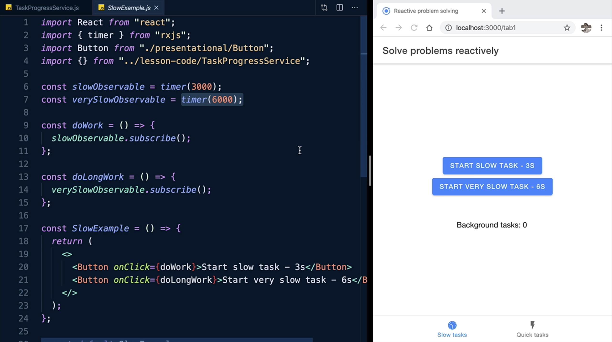
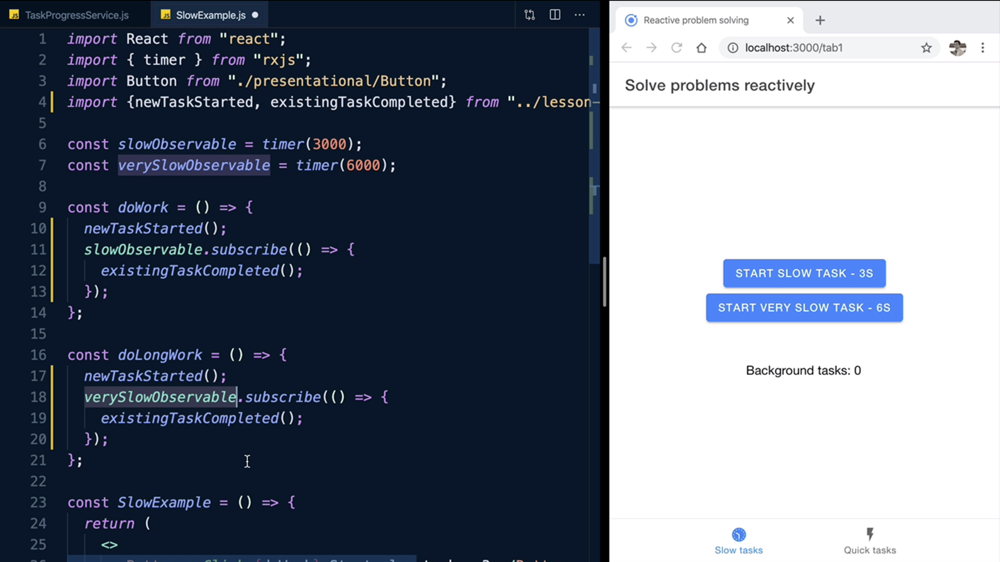
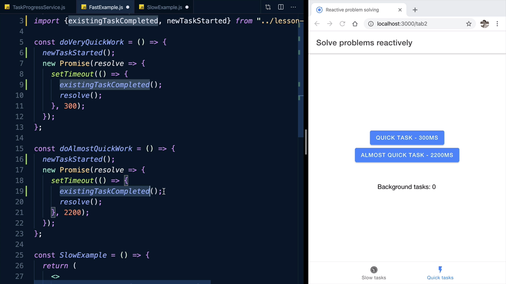

# Expose complex reactive code as simple function based APIs

[Video link](https://www.egghead.io/lessons/egghead-expose-complex-reactive-code-as-simple-function-based-apis)

Instructor: [00:00] Now that we solved our problem, we can go back and focus on our Observables. How do we make them emit whenever a task starts or complete? Tasks come in all shapes and sizes. It might be an *Observable* that someone's just *Subscribed* to and we're waiting for it to emit or it might be a `setTimeout()` or even a `fetch()` request that's been fired off to some server.

```js
/*
  timer(6000).subscribe(...)
  setTimeout(() => ..., 6000)
  fetch('someapi.com', () => ...)
*/
```

[00:19] We need to expose the most widely applicable API possible, so that whenever a task is created or completes, we can easily tell our servers about it. The most generic API you can think of is a *function*, a simple `function` that's called `newTaskStarted`, which is going to be *exported* from our service.

### TaskProgressService.js
```js
/*
  timer(6000).subscribe(...)
  setTimeout(() => ..., 6000)
  fetch('someapi.com', () => ...)
*/

export function newTaskStarted() {

}

const taskStarts = new Observable();
```

[00:34] All somebody needs to do to tell us that a task has started is to `import` and call this. Let's do one for tasks ending as well. How do we tell this *Observable* to emit whenever this *function* is called? We can just use subjects `Subject()` and they've already been imported from the top-level package.

```js
import { Observable, merge, Subject } from "rxjs";

...

/*
  timer(6000).subscribe(...)
  setTimeout(() => ..., 6000)
  fetch('someapi.com', () => ...)
*/

export function newTaskStarted() {

}

export function existingTaskCompleted() {

}
```

[00:50] A `Subject()` is both an `Observable()` and an observer. In other words, whenever we call `.next()` on this, it will also cause the `Observable()` to emit a notification to whoever is *Subscribed* to it. I'll just do the same for `taskCompletions` as well. Let's look at our project now.

```js
/*
  timer(6000).subscribe(...)
  setTimeout(() => ..., 6000)
  fetch('someapi.com', () => ...)
*/

export function newTaskStarted() {
taskStarts.next();
}

export function existingTaskCompleted() {
  taskCompletions.next();
}
```

[01:05] I have here some `components`. I'll just open up the `SlowExample.js` and also open the app to the side. These two buttons here are responsible for the two buttons on the first step. Whenever you click on the button, it *Subscribes* to an *Observable* that emits after three seconds or six seconds for the longer one.

### SlowExample.js Overview


[01:25] We have our service already *imported* here. I'm just going to pick our two *exported functions*. We want to call this whenever one of the buttons is pressed. We want to call `existingTaskCompleted()` right in the `.subscribe()` for both of the *Observables*. Basically, we consider them completed whenever they emit.

### On Button Click Example


[01:44] Why are we going from an *Observable* to a *Function*, back to an *Observable* again? Let's open up our code for the other tab. This is the `component` responsible for our second tab at the bottom. Here we're dealing with *Promises*. Because we've kept our API simple, we can now `import` our two *functions* (`existingTaskCompleted, newTaskStarted`) again and call `newTaskStarted()` before the *Promises* are created and `newTaskCompleted()` right before they `resolve`.

[02:10] Now, whenever a button is clicked, it's going to tell our service that the new task has started. Whenever this `Promise` resolves after a few seconds, it's going to tell our service that a task has just completed.

### Button Reactions


[02:22] To recap, we've been taking advantage of RxJS to create readable streams of nicely flowing logic. We paid attention to how we create these obstructions to keep our solution maintainable and robust, but most code bases are not using RxJS.

[02:37] To keep our features usable in as many places as possible, we exposed two simple functions to the outside world, and we connected those function calls to the sources that trigger all of our internal reactive logic via subject.