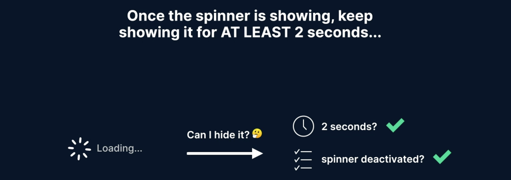

# Use combineLatest to only emit notifications when certain events have happened

[Video link](https://www.egghead.io/lessons/egghead-use-combinelatest-to-only-emit-notifications-when-certain-events-have-happened)

Instructor: [00:00] But now we have a new problem. If we have a task that lasts just a bit over two seconds like this one, you'll notice there's a delay, but then the spinner quickly appears and disappears again.

### New Problem


[00:11] Let's try it again. It appears and then disappears quickly. We're back to square one of having a glitchy spinner. Our problem stems from the decision to hide the spinner for the first two seconds of activity and only show it after that.

### Time Diagram


[00:27] If this segment is really small, it's going to look glitchy again. Our virtual manager comes in and tells us that once the spinner is showing, keep showing it for at least two seconds. Before jumping in to implement this, let's think about how we can reword it.

[00:45] Once the spinner is showing, when can we hide it? Well, we need to listen for two events in parallel. Have two seconds passed since we started showing it? Check. Did we also get the signal that we have zero tasks remaining and the spinner is inactive?

### Checklist


[01:01] It doesn't really matter in which order these become true. The spinner might get deactivated before the two seconds are up, as in the case of the problematic task we just saw. The two seconds might be reached way before we get the signal to deactivate the spinner, as in the case of a really, really long task.

[01:18] If both of these are true, we can hide the spinner. Let's use the space we have at this level of abstraction. The new answer to the question when does the spinner need to hide will be when two events have happened, spinner became inactive and two seconds have passed.

### Obstruction Levels - Added Segment


[01:35] I'll copy this to my code. I'll put it right here at this level. I'll declare `shouldHideSpinner` and I'll use the `combineLatest()` operator. `combineLatest()` waits for all of its inputs to emit before emitting for the first time. The first event I want to wait for is `spinnerDeactivated`. The second is a timer of two seconds (`timer(2000)`).

### TaskProgressService.js
```js
import { Observable, merge, Subject } from "rxjs";
import {
  mapTo,
  scan,
  startWith,
  distinctUntilChanged,
  shareReplay,
  filter,
  pairwise
} from "rxjs/operators";

export function newTaskStarted() {
taskStarts.next();
}

export function existingTaskCompleted() {
  taskCompletions.next();
}

const taskStarts = new Observable();
const taskCompletions = new Observable();

const loadUp = taskStarts.pipe(mapTo(1));
const loadDown = taskCompletions.pipe(mapTo(-1));

// xxxxxxxxxxxxxxxxxxxxxxxxxxxxxxxxxxxxxxxxxxxxxxxxxxxxxxxxxxxxxx //

const loadVariations = merge(loadUp, loadDown);

const currentLoadCount = loadVariations.pipe(
    startWith(0),
    scan((totalCurrentLoads, changeInLoads) => {
      return totalCurrentLoads + changeInLoads;
    }),
    distinctUntilChanged(),
    shareReplay({ bufferSize: 1, refCount: true })
);

// xxxxxxxxxxxxxxxxxxxxxxxxxxxxxxxxxxxxxxxxxxxxxxxxxxxxxxxxxxxxxx //

const spinnerDeactivated = currentLoadCount.pipe(
  filter(count => count === 0)
);

const spinnerActivated = currentLoadCount.pipe(
  pairwise(),
  filter(([prevCount, currCount]) => prevCount === 0 && currCount === 1))
);

// xxxxxxxxxxxxxxxxxxxxxxxxxxxxxxxxxxxxxxxxxxxxxxxxxxxxxxxxxxxxxx //

/*
The moment the spinner becomes active...
    Switch to waiting for 2s before showing it
    But cancel if it becomes inactive again in the meantime
*/

const shouldShowSpinner = spinnerActivated.pipe(
  switchMap(() => timer(2000).pipe(takeUntil(spinnerDeactivated)))
)

/*
When does the spinner need to hide?

When 2 events have happened:
    Spinner became inactive
    2 seconds have passed
*/

const shouldHideSpinner = combineLatest(
  spinnerDeactivated,
  timer(2000)
)

// xxxxxxxxxxxxxxxxxxxxxxxxxxxxxxxxxxxxxxxxxxxxxxxxxxxxxxxxxxxxxx //

shouldShowSpinner
  .pipe(switchMap(() => showSpinner.pipe(takeUntil(spinnerDeactivated))))
  .subscribe();

export default {};
```

[01:59] *combineLatest()* is usually used to combine the latest emissions from its inputs and emit them as an array, but we don't need the combination capabilities. We're just using it to wait for two separate events to happen before emitting. We've seen this two-second timer before. It actually represents our flash threshold.

[02:19] Anything flashing on the screen for less than two seconds we consider a bad experience for the user. I'll extract it out and I'll replace it here and here. Now, I just need to replace this (`shouldHideSpinner`) in our top level stream. Let's go and test this out.

### TaskProgressService.js
```js
import { Observable, merge, Subject } from "rxjs";
import {
  mapTo,
  scan,
  startWith,
  distinctUntilChanged,
  shareReplay,
  filter,
  pairwise
} from "rxjs/operators";

export function newTaskStarted() {
taskStarts.next();
}

export function existingTaskCompleted() {
  taskCompletions.next();
}

const taskStarts = new Observable();
const taskCompletions = new Observable();

const loadUp = taskStarts.pipe(mapTo(1));
const loadDown = taskCompletions.pipe(mapTo(-1));

// xxxxxxxxxxxxxxxxxxxxxxxxxxxxxxxxxxxxxxxxxxxxxxxxxxxxxxxxxxxxxx //

const loadVariations = merge(loadUp, loadDown);

const currentLoadCount = loadVariations.pipe(
    startWith(0),
    scan((totalCurrentLoads, changeInLoads) => {
      return totalCurrentLoads + changeInLoads;
    }),
    distinctUntilChanged(),
    shareReplay({ bufferSize: 1, refCount: true })
);

// xxxxxxxxxxxxxxxxxxxxxxxxxxxxxxxxxxxxxxxxxxxxxxxxxxxxxxxxxxxxxx //

const spinnerDeactivated = currentLoadCount.pipe(
  filter(count => count === 0)
);

const spinnerActivated = currentLoadCount.pipe(
  pairwise(),
  filter(([prevCount, currCount]) => prevCount === 0 && currCount === 1))
);

// xxxxxxxxxxxxxxxxxxxxxxxxxxxxxxxxxxxxxxxxxxxxxxxxxxxxxxxxxxxxxx //

/*
The moment the spinner becomes active...
    Switch to waiting for 2s before showing it
    But cancel if it becomes inactive again in the meantime
*/

const flashThreshold = timer(2000);

const shouldShowSpinner = spinnerActivated.pipe(
  switchMap(() => flashThreshold.pipe(takeUntil(spinnerDeactivated)))
)

/*
When does the spinner need to hide?

When 2 events have happened:
    Spinner became inactive
    2 seconds have passed
*/

const shouldHideSpinner = combineLatest(
  spinnerDeactivated,
  flashThreshold
)

// xxxxxxxxxxxxxxxxxxxxxxxxxxxxxxxxxxxxxxxxxxxxxxxxxxxxxxxxxxxxxx //

shouldShowSpinner
  .pipe(switchMap(() => showSpinner.pipe(takeUntil(shouldHideSpinner))))
  .subscribe();

export default {};
```

[02:37] If I trigger the task that takes just a bit over two seconds and please watch the count of background tasks along with the spinner at the bottom, there will be a small two second delay, the spinner shows and then it hides again. Even though the count of background tasks went to zero, the spinner was still up for the full two seconds that we wanted it to. It's not glitchy anymore.

[02:58] Let's see that again. I'll click this, we wait for a bit, the spinner shows, tasks go to zero and then the spinner hides. This top one, which is really quick continues to work as normal. It doesn't trigger any spinners at all.

[03:12] What's cool is that if we have a really long task like this one and again, please pay attention to both the spinner and the number of tasks we have here, the spinner will wait the obligatory two seconds and then show up. The moment the tasks go down to zero, the spinner will hide as well.

[03:31] If we have a task that's long enough and wouldn't cause a glitch by ending too quickly, the spinner hides immediately as soon as it's deactivated.

[03:40] To recap, we really spent some time to understand and then rejuggle our initial requirement into something that makes a bit more sense. We used *combineLatest()* to wait for two separate events to happen. We created another proxy between events of spinner becoming deactivated (*spinnerDeactivated*) in our disposal of the spinner in the top-level stream (*shouldHideSpinner*).
