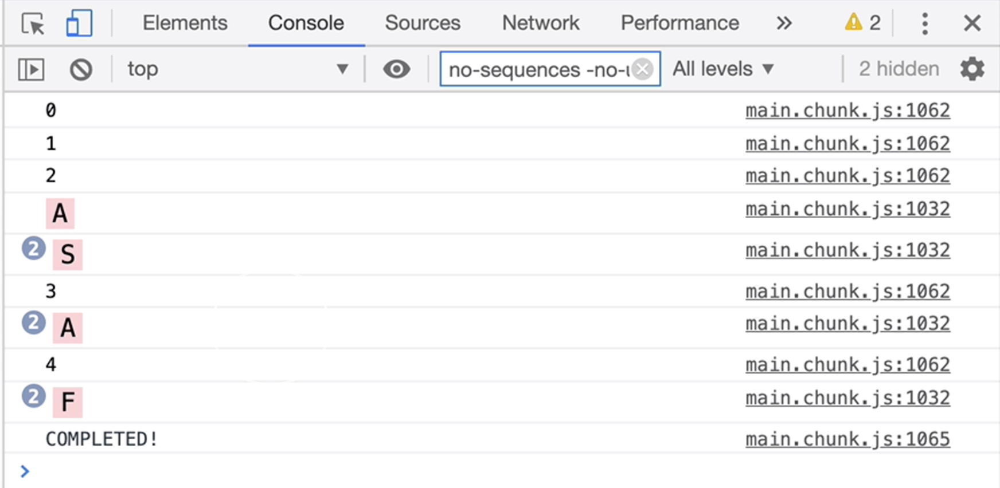

# Use exhaustMap to wait for open combos to finish before starting new ones

[Video link](https://www.egghead.io/lessons/egghead-use-exhaustmap-to-wait-for-open-combos-to-finish-before-starting-new-ones)

Instructor: [00:00] But there's still a problem with our implementation. Let's change the combo to have the initiator, the letter A somewhere in the middle as well. Now to trigger the combo, we need to press the letters `'a', 's', 'a'` and finally `'f'`. I'll switch to the app. The timer starts. I press the letters A, S, A, and then F.

### EventCombo.js
```js
const comboTriggered = keyCombo(["a", "s", "a", "f"])
```

### Unknown Continuation


[00:23] It keeps going. It doesn't complete even though we typed the letters in the required amount of time. Why is that? Well, this *Observable* fires whenever the *comboInitiator* is pressed. In our case, the *comboInitiator* is the letter A. When A is pressed, the inner combo starts. We then press S which goes through this and it's all good.

[00:42] Then when we press A again, this upp *Observable* fires. Because of how *switchMap* works, it's going to immediately dispose of this inner *Observable* and just start a brand-new combo. If we have the *comboInitiator* anywhere else in our combo, this will never work.

[00:58] To fix it, I'll replace our `switchMap` with an `exhaustMap`. What *exhaustMap* does is it ignores any notifications from the source until its inner *Observable* has completed. Now when we press the letter A, the inner combo will activate.

```js
function keyCombo(keyCombo) {
  const comboInitiator = keyCombo[0];
  return keyPressed(comboInitiator).pipe(
    exhaustMap(() => {
      //WE ARE NOW IN COMBO MODE
      return anyKeyPresses.pipe(
        takeUntil(timer(3000)),
        takeWhile((keyPressed, index) => keyCombo[index + 1] === keyPressed),
        skip(keyCombo.length - 2),
        take(1)
      )
    })
  )
}
```

[01:13] Once this is active, any notifications from the source will be ignored until one of these takes ends the inner combo and we're ready to start listening for a new combo. Let's try that out. The timer starts. I'll press A, S, A and then F and it completes. Nice, it works.

### Exhaust Map Output


[01:31] Let's use this to disable our spinner. I'll remove our debug element. I'll `export` the *function* (*keyCombo()*). I'll now go back to our *TaskProgressService.js* and `import` our `keyCombo` from our *EventCombo* package.

```js
import { fromEvent, timer } from "rxjs";
import {
  map,
  filter,
  takeUntil,
  takeWhile,
  skip,
  exhaustMap,
  take
} from "rxjs/operators";

const anyKeyPresses = fromEvent(document, "keypress").pipe(
  map(event => event.key)
);

function keyPressed(key) {
  return anyKeyPresses.pipe(filter(pressedKey => pressedKey === key));
}

export function keyCombo(keyCombo) {
  const comboInitiator = keyCombo[0];
  return keyPressed(comboInitiator).pipe(
    exhaustMap(() => {
      return anyKeyPresses.pipe(
        takeUntil(timer(3000)),
        takeWhile((keyPressed, index) => keyCombo[index + 1] === keyPressed),
        skip(keyCombo.length - 2),
        take(1)
      );
    })
  );
}
```

### TaskProgressService.js
```js
import { keyCombo } from "./EventCombo";
```

[01:46] I'll define a new *Observable* called `hideSpinnerCombo`. It's going to be a `keyCombo` of the letters, `'q', 'w', 'e', 'r', 't', 'y'`. Our requirement was that we need to disable the spinner completely when the combo is triggered. It's not enough to just add it to this *takeUntil*. We need to add it right at the tail.

```js
const hideSpinnerCombo = keyCombo(['q', 'w', 'e', 'r', 't', 'y']);

shouldShowSpinner
  .pipe(switchMap(() => spinnerWithStats.pipe(takeUntil(shouldHideSpinner))))
  .subscribe();
```

[02:07] I'll do another `takeUntil(hideSpinnerCombo)`. Whenever this is triggered, it's going to completely dispose of everything above it. Once this fires, the spinner should get disabled forever.

```js
const hideSpinnerCombo = keyCombo(['q', 'w', 'e', 'r', 't', 'y']);

shouldShowSpinner
  .pipe(
    switchMap(() => spinnerWithStats.pipe(takeUntil(shouldHideSpinner)))
    takeUntil(hideSpinnerCombo))
  .subscribe();
```

[02:19] If I switch back to the app, I'm going to trigger a task. I'll start typing in my combo and the moment I press Y, the spinner hides. If I try to trigger more tasks, we can see that the spinner doesn't even show at all because it's been disabled.

### Disabling Spinner Output

