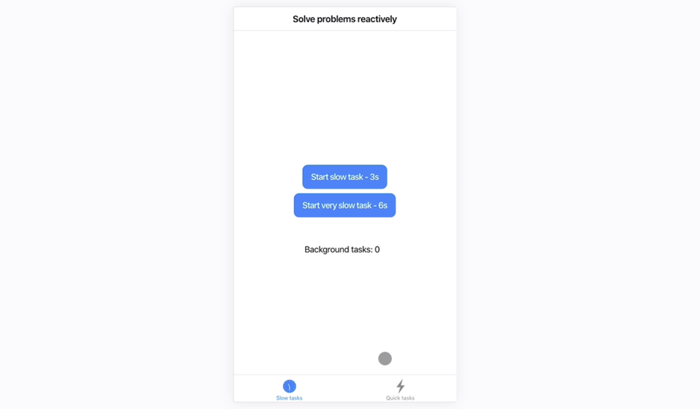
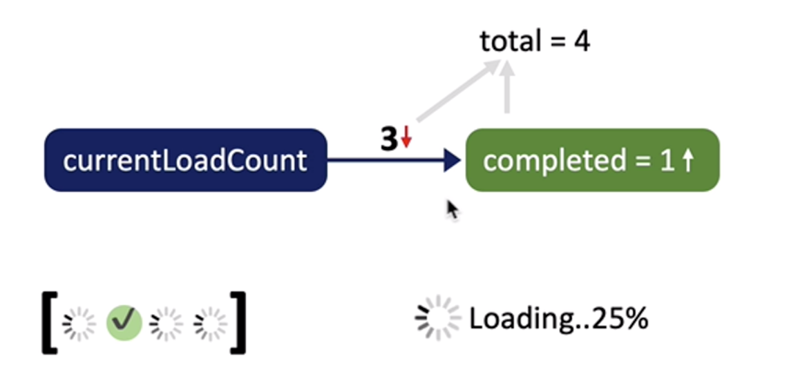
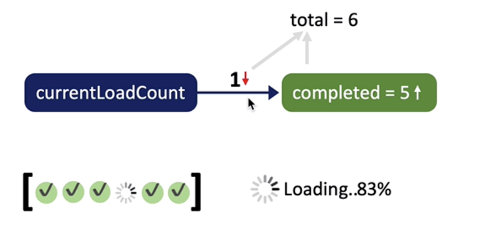
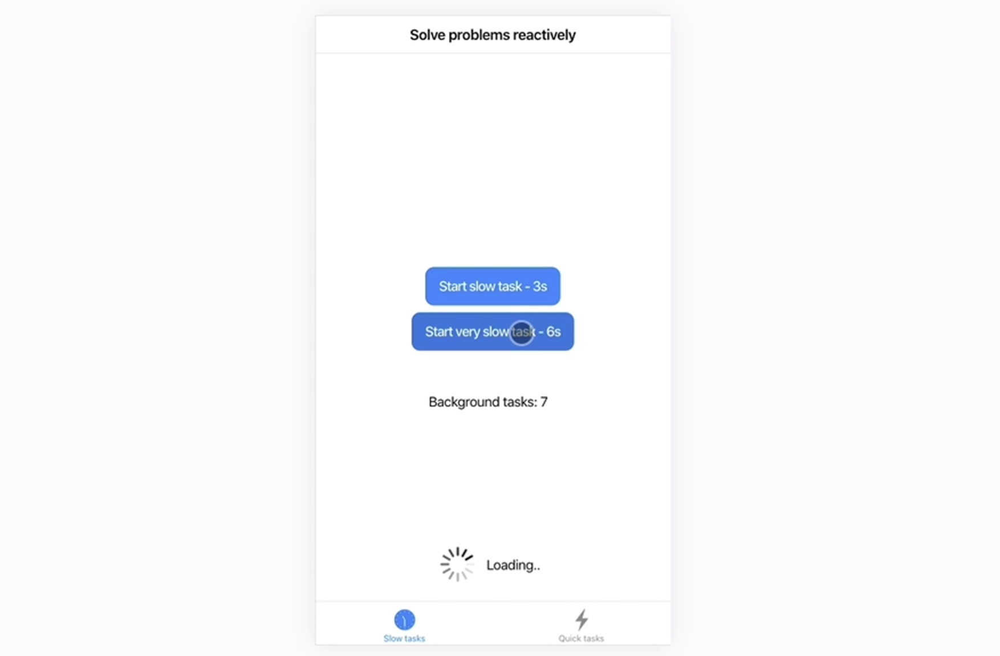

Instructor: [0:00] Our virtual manager congratulates us on the quick turnaround of the last two feature requests, but then suggests another improvement we can make.

[00:07] Users want to see a percentage progress indicator of how many tasks are left to display in the background. We can imagine that in our head. We see a spinner here, and as tasks are going down, a percentage will slowly increase up to 100 percent, at which point the spinner will hide.

### Original App Interface


[00:27] As we've seen with previous requirements, it helps to understand the problem before diving into writing code. Imagine an empty array. Then suddenly, a task starts, so the spinner shows. There's no point in showing zero percent when nothing has loaded. It doesn't help or offer any important info.

### Empty Array Spinner


[00:46] Then a few more tasks start as well. We now have four loading tasks, zero percent of them have finished. Then one of them finishes. 25 percent of them have finished. Then another finishes, 50 percent are complete now. Then another, 75 percent complete.

### Empty Loading Tasks


### 75% Loading Tasks


[01:03] Just before the last one has a chance to complete as well, a new one starts. That brings our total loaded count back a bit, to 60 percent, out of a total five. Another one starts. Now only 50 percent out of the total have completed. Now they start completing again, and again. Now we have five completed out of a total of six, which is 83 percent.

### 60% Loading Tasks


### 50% Loading Tasks


### 83% Loading Tasks


[01:26] How do we show this percentage number on the screen? It turns out that our `initLoadingSpinner` function takes two parameters -- a `total` and a `completed`. Let's mock them up here. As in our visualization, the `total` will be `6` and the `completed` will be `5`.

### TaskProgressService.js
```js
const total = 6;
const completed = 5;
const showSpinner = new Observable(() => {
  const loadingSpinnerPromise = initLoadingSpinner(total, completed);

  loadingSpinnerPromise.then(spinner => {
    spinner.show();
  });

  return () => {
    loadingSpinnerPromise.then(spinner => {
      spinner.hide();
    });
  };
});
```

[01:45] Our library, based on these two, will calculate the percentage completed out of the total and display it on the screen. If we go back to the app and launch a task, we can see it displaying 83 percent. This is static. We need to make this number dynamic, based on how many tasks are actively loading and have completed since we started showing it.

[02:11] To make it easier and allow us to pass in these two numbers, I'll wrap this `Observable()` in a *function* that accepts them as arguments. Where can we get these two numbers (`total`, `completed`) from?

```js
const showSpinner = (total, completed) => new Observable(() => {
  const loadingSpinnerPromise = initLoadingSpinner(total, completed);

  loadingSpinnerPromise.then(spinner => {
    spinner.show();
  });

  return () => {
    loadingSpinnerPromise.then(spinner => {
      spinner.hide();
    });
  };
});
```

[02:23] If we go back to visualizing this, if our `total` is the length of the array, then it can be calculated from how many have completed and how many are still yet to load. To solve our problem, really, we just need to know how many have completed and how many are still loading.

### Total Visualization


[02:41] To get how many are loading, we already have an *Observable* we've built earlier, the `currentLoadCount`. That's why it's good to keep abstractions that make sense on their own. You don't know when you'll need them later.

[02:54] Now, let's look at what happens when our `currentLoadCount` *Observable* emits. When the number of loading tasks goes up, our total goes up as well. When the `currentLoadCount` goes down, that's a sign that a task has completed, so we increase completed by one.

### Current Load Count Visualization


[03:12] When it goes down again from three to two, and then to one, we keep increasing completed. When it starts going up again, we leave completed alone. If you watch total, it's always going to reflect the sum of these two. When number of loading tasks goes down again, completed goes up.

### Current Load Count Visualization (Update)


[03:31] Let me define a `loadStats` *Observable* that will take the `currentLoadCount`, and because we need to keep track of state, I'll `pipe()` it to a `scan()` which will accept the *function*. I'll refer to the previous state as `loadStats` and the new loading count will be `loadingUpdate`.

```js
const currentLoadCount = loadVariations.pipe(
  startWith(0),
  scan((totalCurrentLoads, changeInLoads) => {
    return totalCurrentLoads + changeInLoads;
  }),
  distinctUntilChanged(),
  shareReplay({ bufferSize: 1, refCount: true })
);

// xxxxxxxxxxxxxxxxxxxxxxxxxxxxxxxxxxxxxxxxxxxxxxxxxxxxxxxxxxxxxx //

const loadStats = currentLoadCount.pipe(
  scan((loadStats, loadingUpdate) => {

  })
)

// xxxxxxxxxxxxxxxxxxxxxxxxxxxxxxxxxxxxxxxxxxxxxxxxxxxxxxxxxxxxxx //
```

[03:52] Now, what kind of state will this return? We need to know `total` and `completed` to pass to our spinners. I'll initialize them with `0` for now. To calculate `completed`, we need to know whether the loading count has gone up or down. For that, we need to keep track of the `previousLoading` count as well.

```js
const loadStats = currentLoadCount.pipe(
  scan((loadStats, loadingUpdate) => {
    return {
      total: 0,
      completed: 0,
      previousLoading: 0
    }
  })
)
```

[04:12] The loads went down if the new `loadingUpdate` is smaller than the `previousLoading`. The current value of completed tasks if loads went down, will be the previous value plus one, otherwise it stays the same.

```js
const loadStats = currentLoadCount.pipe(
  scan((loadStats, loadingUpdate) => {
    const loadsWentDown = loadingUpdate < loadStats.previousLoading;
    const currentCompleted = loadsWentDown ? loadStats.completed + 1 : loadStats.completed;
    return {
      total: 0,
      completed: 0,
      previousLoading: 0
    }
  })
)
```

[04:31] `completed` will be `currentCompleted`, `previousLoading` will become the new `loadingUpdate`, and `total` will be completed (`currentCompleted`) plus the `loadingUpdate`. I'll also define the initial state and they will all start from `0`.

```js
const loadStats = currentLoadCount.pipe(
  scan((loadStats, loadingUpdate) => {
    const loadsWentDown = loadingUpdate < loadStats.previousLoading;
    const currentCompleted = loadsWentDown ? loadStats.completed + 1 : loadStats.completed;
    return {
      total: currentCompleted + loadingUpdate,
      completed: currentCompleted,
      previousLoading: loadingUpdate
    }
  }, {total: 0, completed: 0, previousLoading: 0})
)
```

[04:44] What happens all tasks complete and we're at 100 percent again? We want to reset the `total` and `completed` back to `0` again as well, so they are ready for the next time we need to show the spinner and start calculating the percentage.

[04:59] One solution will be to add a special condition in our *scan*, so that whenever `loadingUpdate` is `0`, we also reset `completed` and `total` back to `0`. It turns out, we don't even have to think about resetting the state.

[05:13] I'll show you what I mean by creating an *Observable* called `spinnerWithStats`, which will listen to the `loadStats` and switch to showing a spinner with the correct percentage any time our stats change. Now, instead of showing the simple spinner, we'll show a spinner with stats.

```js
const loadStats = currentLoadCount.pipe(
  scan((loadStats, loadingUpdate) => {
    const loadsWentDown = loadingUpdate < loadStats.previousLoading;
    const currentCompleted = loadsWentDown ? loadStats.completed + 1 : loadStats.completed;
    return {
      total: currentCompleted + loadingUpdate,
      completed: currentCompleted,
      previousLoading: loadingUpdate
    }
  }, {total: 0, completed: 0, previousLoading: 0})
)

// xxxxxxxxxxxxxxxxxxxxxxxxxxxxxxxxxxxxxxxxxxxxxxxxxxxxxxxxxxxxxx //

const spinnerWithStats = loadStats.pipe(
  switchMap(stats => showSpinner(stats.total, stats.completed))
);
```

[05:36] Remember, that *scan()* keeps track of its state only while it has subscribers. Whenever the spinner needs to be shown, we'll switch to this *Observable*, which internally will initialize the new state for *scan()* and will start tracking the percentage. Whenever we need to dispose of it, it will delete and reset any state for the percentage that we were keeping track of.

[05:59] Because we tied the life cycle of our spinner (`showSpinner`) and `loadStats` *Observables* together, they'll get created and disposed off together, which will handle resetting the scanned state for us. This is a case where we want the state for the *scan()* to be local. We want to take advantage of the fact that it maintains state only while the *Observable* it's a part of is active.

[06:22] Let's test it. I'll create a few slow tasks, then a few quick ones, and then a few slow ones again. You'll notice that when I create new tasks, the percentage goes down, and then it starts going up again, all the way up to 100 percent, at which point it hides. Important, if I start it up again, it starts again from zero, so we can see that the resetting has worked.

### Spinner with Stats


[06:46] Takeaways from this, so if you have state and that state needs to be reset, say, when this goes back down to zero, consider the life cycle of the *Observable* *scan()* belongs to rather than manually resetting it. This is powerful, because we can focus on what this *Observable* does, which is tracking the loading stats, and not have to worry about when to clean up and do the resets.

[07:09] In this case, we found another *Observable* that it had to share some life cycle with, and we just combined them into this other stream. It's at this upper level where we decide its life cycle, and with it, the clean-up of the state.
