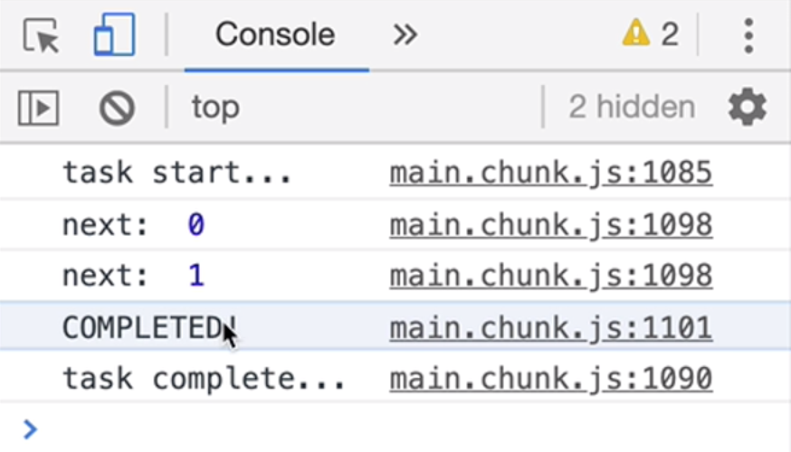
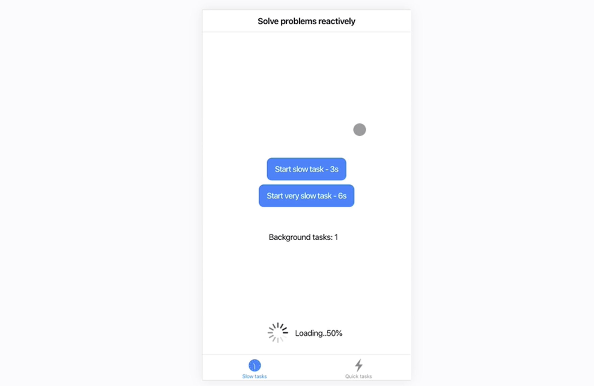

Instructor: [00:00] We've built our service and it works great, but has a very, very simple API, a function you can call to tell it that a task has started and one to tell it that a task is completed.

[00:11] This is great because it opens up our service to be used in the largest amount of context with *Observables*, *Promises*, *setTimeouts*, *fetchEvents*, and other things we haven't even thought of. For the most popular use cases like *Observables*, we can provide additional extensions on top of it to make it even easier to use.

[00:32] As right now, anytime a developer wants to track an *Observable*, it has to remember to call this right before it starts and then this right when it completes.

[00:41] A much more idiomatic solution for an RxJS context is an *Operator*. We'd `.pipe` it to an *Observable* and they would automatically mark a task as started whenever this is *subscribed* to and mark it as done whenever it completes, whenever the timer fires.

### SlowExample.js
```js
const slowObservable = timer(3000).pipe(showLoadingStatus());
const verySlowObservable = timer(6000);
```

[00:57] Let's build an *Operator*. All an *Operator* is is a *function* that takes a `source` Observable and returns another `Observable`. If I declare an `interval` that emits every half a second and we just take the first two values from it and then we `.subscribe`. I'll log `next:` notifications as well as completion events.

### Extensions.js
```js
function showLoadingStatus(source) {
  return new Observable();
}

interval(500).pipe(
  take(2)
  .subscribe({
    next: x => console.log("next: ", x),
    complete: () => console.log("COMPLETED!")
  })
)
```

[01:20] If I wanted to track this Observable, `interval`, with my newly created *Operator*, I could just add it in our `.pipe`. Now my source would just be this, but because the convention is to make these *Operators* configurable by calling them as you pass them in the pipe, we're going to wrap our `return` in a function that returns our Operator function. I know we're not really passing anything to this, but we're just following the convention.

```js
function showLoadingStatus() {
  return source => {
    return new Observable();
  };
}

interval(500)
  .pipe(
    take(2),
    showLoadingStatus())
  .subscribe({
    next: x => console.log("next: ", x),
    complete: () => console.log("COMPLETED!")
    })
```

[01:48] I'll now `import` our task functions from our service. If you remember from earlier, the *function* we pass to the *Observable* constructor will get called any time somebody *subscribes* to this *Observable*. This is a perfect place to call our new `taskStarted` function.

```js
import {
    existingTaskCompleted,
    newTaskStarted
  } from "../lesson-code/TaskProgressService";

function showLoadingStatus() {
  return source => {
    return new Observable(() => {
      // I'VE BEEN SUBSCRIBED TO
      newTaskStarted();
    });
  };
}
```

[02:05] The second thing we want to do is we want to make sure this Operator, `showLoadingStatus()`, passes all notifications it gets from the *source* downwards to its subscribers. To listen for notifications from the source, I'll just `subscribe` to it. Whenever somebody *subscribes* to our returned *Observable*, we'll get a reference to that `subscriber`. Now I can just pass all the events from the *source* down to our `subscriber`.

```js
function showLoadingStatus() {
  return source => {
    return new Observable((subscriber) => {
      // I'VE BEEN SUBSCRIBED TO
      newTaskStarted();
      source.subscribe(subscriber);
    });
  };
}
```

[02:31] Finally, we need to make sure we *unsubscribe* from this whenever our *Observable* gets disposed of. I'll store a reference to the subscription, `sourceSubscription`. In the disposable *function* we learned about earlier, I'll just call `unsubscribe()` on our subscription (`sourceSubscription`).

```js
function showLoadingStatus() {
  return source => {
    return new Observable((subscriber) => {
      // I'VE BEEN SUBSCRIBED TO
      newTaskStarted();
      const sourceSubscription = source.subscribe(subscriber);
      return () => {
        sourceSubscription.unsubscribe();
        existingTaskCompleted();
      }
    });
  };
}
```

[02:46] Since we started the task in our Observable and the event that this *Observable* is disposed of, we also want to complete the task with `existingTaskcompleted()`. Otherwise, we run the risk of the spinner staying on the screen forever. Let me just add some `console.log()` so we can see when *taskStarted* is getting called and when *taskComplete* is getting called. I'm also going to `import` all the RxJS tokens that we've missed.

```js
import {
  existingTaskCompleted,
  newTaskStarted
} from "../lesson-code/TaskProgressService";
import { Observable, interval } from "rxjs";
import { take } from "rxjs/operators";

function showLoadingStatus() {
  return source => {
    return new Observable((subscriber) => {
      // I'VE BEEN SUBSCRIBED TO
      newTaskStarted();
      console.log("task start...")
      const sourceSubscription = source.subscribe(subscriber);
      return () => {
        sourceSubscription.unsubscribe();
        existingTaskCompleted();
        console.log("task complete...")
      }
    });
  };
}
```

[03:09] If I bring in the console, we can see that we correctly called *taskStarted* whenever we *subscribed* to it. We then get the two notifications from the interval. Because we only take the first two, we then get a complete notification.

### Correct Call Verifications


[03:24] What's interesting is that even though we don't explicitly *unsubscribe* from this one, we still get our *taskComplete* invocation inside our disposal *function*. That's because whenever our *Observer* gets a complete notification, it's going to immediately *unsubscribe* from its source *Observable*, which is going to trigger the disposal *function* in our *Operator*. Awesome.

[03:48] Let me just remove the debugging statements and I'll `export` our *Operator*. 

```js
export function showLoadingStatus() {
  return source => {
    return new Observable((subscriber) => {
      // I'VE BEEN SUBSCRIBED TO
      newTaskStarted();
      const sourceSubscription = source.subscribe(subscriber);
      return () => {
        sourceSubscription.unsubscribe();
        existingTaskCompleted();
      }
    });
  };
}
```

Then I'll go back to `SlowExample.js`. I'll remove any reference to our *service* and instead I'll just `import { showLoadingStatus } from "../lesson-code/Extensions"`. I'll add it to this *Observable* as well. Finally, I'll just remove all the extra invocations to the old service.

### SlowExample.js
```js
import { showLoadingStatus } from "../lesson-code/Extensions";  

const slowObservable = timer(3000).pipe(showLoadingStatus());
const verySlowObservable = timer(6000).pipe(showLoadingStatus());

const doWork = () => {
  slowObservable.subscribe();
};

const doLongWork = () => {
  verySlowObservable.subscribe();
};
```

[04:12] If I try this out, I'll just click once on each one of these buttons. The spinner appears and as tasks are completed, eventually it's going to go away. Nice, it works. Now we have an *Operator* that can just be *piped* to any *Observable* in our app and it's going to enable spinner tracking capabilities on that *Observable*.

### Polished Output

